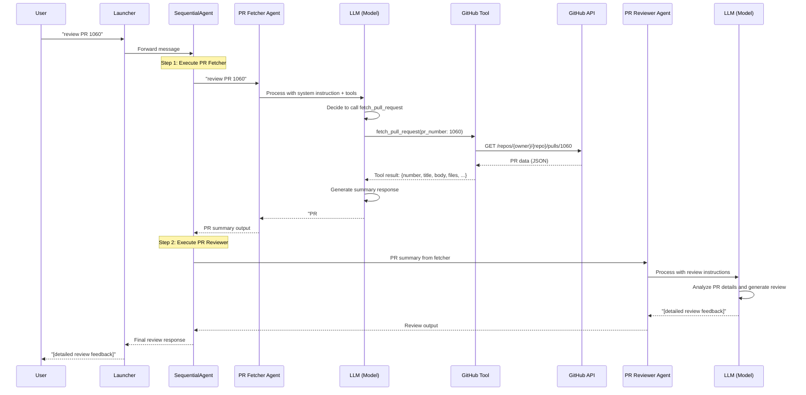

# Message Flow Sequence Diagram

This document describes how messages flow through the PR Review Agent system when a user requests a PR review.

## Mermaid Sequence Diagram



## Simplified Text Flow

```
┌──────┐
│ User │ "review PR 1060"
└──┬───┘
   │
   ▼
┌──────────┐
│ Launcher │ Routes to workflow agent
└──┬───────┘
   │
   ▼
┌──────────────────┐
│ SequentialAgent  │ Orchestrates agent execution
└──┬───────────────┘
   │
   │ Step 1: Execute PR Fetcher
   ▼
┌─────────────────┐
│ PR Fetcher Agent│ Receives: "review PR 1060"
└──┬──────────────┘
   │
   ▼
┌──────────┐
│ LLM      │ Processes → Decides to call fetch_pull_request(1060)
└──┬───────┘
   │
   ▼
┌─────────────┐
│ GitHub Tool │ Executes GetPullRequest(1060)
└──┬──────────┘
   │
   ▼
┌─────────────┐
│ GitHub API  │ Returns PR data
└──┬──────────┘
   │
   │ Tool result flows back up
   │
┌──────────┐
│ LLM      │ Receives PR data → Generates summary
└──┬───────┘
   │
   ▼
┌─────────────────┐
│ PR Fetcher Agent│ Returns: "PR #1060: [summary]"
└──┬──────────────┘
   │
   │ Output flows back to SequentialAgent
   │
┌──────────────────┐
│ SequentialAgent  │ Receives PR summary
└──┬───────────────┘
   │
   │ Step 2: Execute PR Reviewer
   │ (Passes PR summary as input)
   ▼
┌──────────────────┐
│ PR Reviewer Agent│ Receives: PR summary
└──┬───────────────┘
   │
   ▼
┌──────────┐
│ LLM      │ Analyzes PR → Generates review feedback
└──┬───────┘
   │
   ▼
┌──────────────────┐
│ PR Reviewer Agent│ Returns: "[review feedback]"
└──┬───────────────┘
   │
   │ Final output flows back
   │
┌──────────────────┐
│ SequentialAgent  │ Returns final review
└──┬───────────────┘
   │
   ▼
┌──────────┐
│ Launcher │ Returns to user
└──┬───────┘
   │
   ▼
┌──────┐
│ User │ Receives: "[review feedback]"
└──────┘
```

## Detailed Flow

### Step 1: User Input
```
User: "review PR 1060"
```

### Step 2: Launcher → SequentialAgent
```
Launcher receives user message
  ↓
Passes to SequentialAgent (workflowAgent)
```

### Step 3: SequentialAgent → PR Fetcher Agent
```
SequentialAgent receives: "review PR 1060"
  ↓
Passes message to first sub-agent: pr_fetcher
```

### Step 4: PR Fetcher Agent Processing
```
PR Fetcher Agent receives: "review PR 1060"
  ↓
LLM (Model) processes the message with:
  - System instruction: "You are a GitHub PR fetcher agent..."
  - Available tools: [fetch_pull_request, get_pull_request_diff]
  ↓
LLM decides to call: fetch_pull_request(pr_number: 1060)
  ↓
Tool execution:
  - functiontool.Run() called
  - GitHubTool.GetPullRequest(ctx, 1060) executed
  - GitHub API called: GET /repos/{owner}/{repo}/pulls/1060
  - GitHub API returns PR data
  - functiontool converts result to JSON
  ↓
LLM receives tool result:
  {
    "number": 1060,
    "title": "...",
    "body": "...",
    "files": [...],
    ...
  }
  ↓
LLM generates response summarizing PR details
  ↓
PR Fetcher Agent returns: "PR #1060: [summary of PR details]"
```

### Step 5: SequentialAgent → PR Reviewer Agent
```
SequentialAgent receives output from PR Fetcher:
  "PR #1060: [summary of PR details]"
  ↓
Passes this output as input to second sub-agent: pr_reviewer
```

### Step 6: PR Reviewer Agent Processing
```
PR Reviewer Agent receives: "PR #1060: [summary of PR details]"
  ↓
LLM (Model) processes the message with:
  - System instruction: "You are an expert code reviewer..."
  - No tools available (empty Tools array)
  - Context: PR details from previous agent
  ↓
LLM analyzes the PR information and generates review feedback
  ↓
PR Reviewer Agent returns: "[detailed code review feedback]"
```

### Step 7: SequentialAgent → Launcher → User
```
SequentialAgent receives final output from PR Reviewer
  ↓
Returns final response to Launcher
  ↓
Launcher returns to User: "[detailed code review feedback]"
```

## Key Points

1. **Sequential Flow**: The SequentialAgent ensures agents run in order. The output of the first agent becomes the input of the second agent.

2. **Same Model Instance**: Both agents use the same `model.LLM` instance, but they have different:
   - System instructions
   - Available tools
   - Agent names/descriptions

3. **Tool Execution**: Tools are executed automatically by `functiontool` when the LLM decides to call them. The tool results are returned to the LLM as part of the conversation context.

4. **Message Passing**: The SequentialAgent handles passing messages between agents. It doesn't modify the messages - it just routes them sequentially.

5. **Session Management**: The `SessionService` (InMemoryService) maintains conversation history, allowing the agents to have context-aware conversations.

## Alternative: Single Agent Approach

If we removed SequentialAgent and used a single agent with both tools:

```
User -> Launcher -> Single Agent -> LLM (Model) -> GitHub Tools -> GitHub API
                                                      |
                                                      v
User <- Launcher <- Single Agent <- LLM (Model) <- Tool Results
```

The LLM would:
1. Call `fetch_pull_request` to get PR details
2. Receive tool results
3. Generate review feedback based on the PR data
4. Return final review to user

This would be simpler but less modular than the sequential agent approach.

## How LLM Decides to Call Tools

### Tool Declaration Process

When the PR Fetcher Agent is created, the LLM receives:

1. **System Instruction**: "You are a GitHub PR fetcher agent..."
2. **Tool Declarations**: Function schemas for available tools:
   ```json
   {
     "name": "fetch_pull_request",
     "description": "Fetches a pull request by number...",
     "parameters": {
       "type": "object",
       "properties": {
         "pr_number": {"type": "integer", "description": "The pull request number"}
       },
       "required": ["pr_number"]
     }
   }
   ```

### Decision Process

The LLM decides to call a tool based on:

1. **User Intent**: Understanding what the user wants
   - User: "review PR 1060" → LLM infers it needs PR data
   - User: "what changed in PR 1060?" → LLM infers it needs PR diff

2. **Available Tools**: What tools are declared and their descriptions
   - The LLM sees `fetch_pull_request` and `get_pull_request_diff` are available
   - Tool descriptions help the LLM understand when to use each tool

3. **Conversation Context**: What information is already available
   - If PR data was already fetched in this conversation, the LLM might skip calling the tool
   - If the conversation history contains PR details, the LLM can use that instead

4. **System Instructions**: Guidance on agent behavior
   - "When asked to fetch a PR, use the available GitHub tools..." guides the LLM

### Example: Tool Call Decision Flow

```
User: "review PR 1060"
  ↓
LLM receives:
  - System: "You are a GitHub PR fetcher agent..."
  - Tools: [fetch_pull_request, get_pull_request_diff]
  - User message: "review PR 1060"
  - Conversation history: [] (empty, new conversation)
  ↓
LLM reasoning:
  "User wants to review PR 1060. I need PR details to review it.
   I have fetch_pull_request tool available. The conversation history
   doesn't contain PR data yet. I should call fetch_pull_request(1060)."
  ↓
LLM decides: Call fetch_pull_request(pr_number: 1060)
```

### Example: Skipping Tool Call (Context Already Available)

```
Conversation History:
  User: "review PR 1060"
  Assistant: [calls fetch_pull_request(1060)]
  Tool Result: {number: 1060, title: "...", body: "...", files: [...]}
  Assistant: "PR #1060: [summary]"
  
User: "can you review it again with more focus on security?"
  ↓
LLM receives:
  - System: "You are a GitHub PR fetcher agent..."
  - Tools: [fetch_pull_request, get_pull_request_diff]
  - User message: "can you review it again with more focus on security?"
  - Conversation history: [previous messages + PR data]
  ↓
LLM reasoning:
  "User wants another review focused on security. The conversation
   history already contains PR #1060 data from the previous fetch.
   I don't need to call fetch_pull_request again - I can use the
   existing PR data from the conversation history."
  ↓
LLM decides: Skip tool call, use existing context
LLM responds: "Based on PR #1060 data, here's a security-focused review..."
```

## Session Management and Context Retention

### How SessionService Works

The `SessionService` (InMemoryService) maintains conversation history:

1. **Session Creation**: Each conversation gets a unique session ID
2. **Message Storage**: All messages (user + assistant + tool calls + tool results) are stored
3. **Context Building**: When processing a new message, the full conversation history is included

### Conversation History Structure

```
Session History:
[
  {
    "role": "user",
    "content": "review PR 1060"
  },
  {
    "role": "assistant",
    "content": "I'll fetch PR details...",
    "tool_calls": [
      {
        "name": "fetch_pull_request",
        "arguments": {"pr_number": 1060}
      }
    ]
  },
  {
    "role": "tool",
    "name": "fetch_pull_request",
    "content": {
      "number": 1060,
      "title": "...",
      "body": "...",
      "files": [...]
    }
  },
  {
    "role": "assistant",
    "content": "PR #1060: [summary]"
  }
]
```

### When Tool Calls Are Skipped

The LLM will skip calling `fetch_pull_request` if:

1. **PR data exists in conversation history**: The current session already contains PR details
2. **User references previous data**: "review it again", "focus on security", "what about the tests?"
3. **Tool result is recent**: The PR was fetched in the same conversation turn
4. **User provides PR data directly**: User pastes PR details or diff in the message

### When Tool Calls Are Made

The LLM will call `fetch_pull_request` when:

1. **New PR number**: User mentions a different PR number not in history
2. **Fresh conversation**: New session with no previous PR data
3. **Explicit request**: User says "fetch PR 1060" or "get PR details"
4. **Stale data**: LLM determines the cached data might be outdated (though this is rare)

## Practical Implications

### Current Implementation Behavior

In your current setup with `SequentialAgent`:

- **First agent (PR Fetcher)**: Always receives fresh user input, so it will typically call the tool
- **Second agent (PR Reviewer)**: Receives PR summary from first agent, so it doesn't need tools

### Single Agent Alternative

If using a single agent with both tools:

- **First message**: "review PR 1060" → LLM calls `fetch_pull_request`
- **Second message**: "review it again" → LLM skips tool call, uses cached PR data
- **Third message**: "review PR 1061" → LLM calls `fetch_pull_request` for new PR

### Optimizing Tool Calls

To encourage the LLM to skip unnecessary tool calls:

1. **Clear tool descriptions**: Help LLM understand when tools are needed
2. **System instructions**: Guide the LLM on when to use vs. reuse data
3. **Rich conversation history**: Ensure tool results are properly included in context
4. **Explicit caching hints**: In instructions, mention "if PR data is already available, use it"

Example improved instruction:
```
When asked to fetch a PR:
- If PR data is already in the conversation history, use that data
- Only call fetch_pull_request if the PR number is new or data is missing
- Always call get_pull_request_diff if you need the code changes
```

